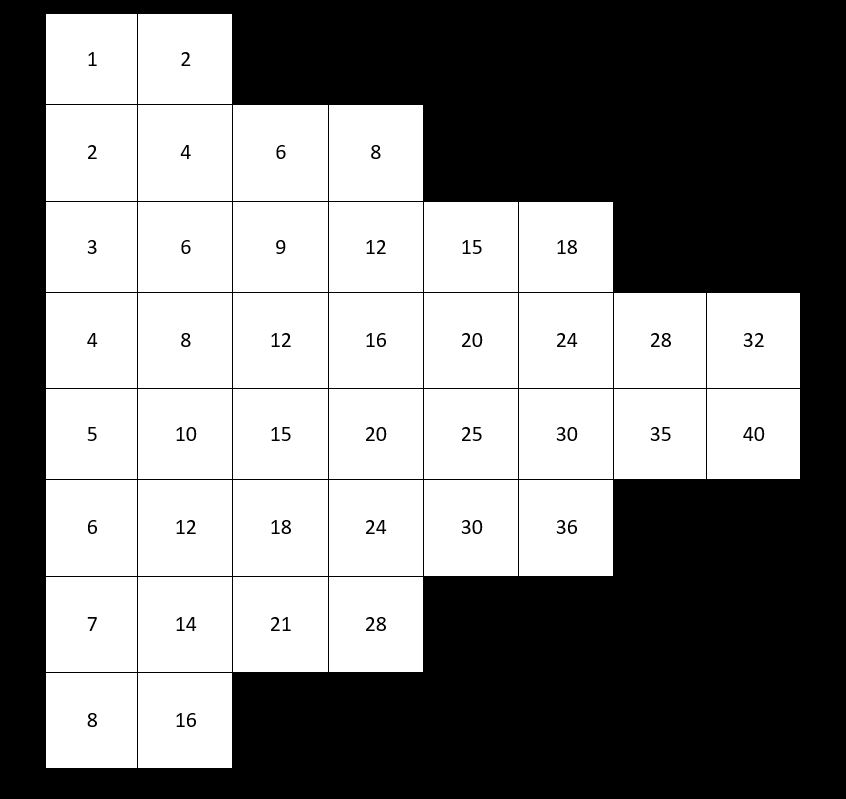
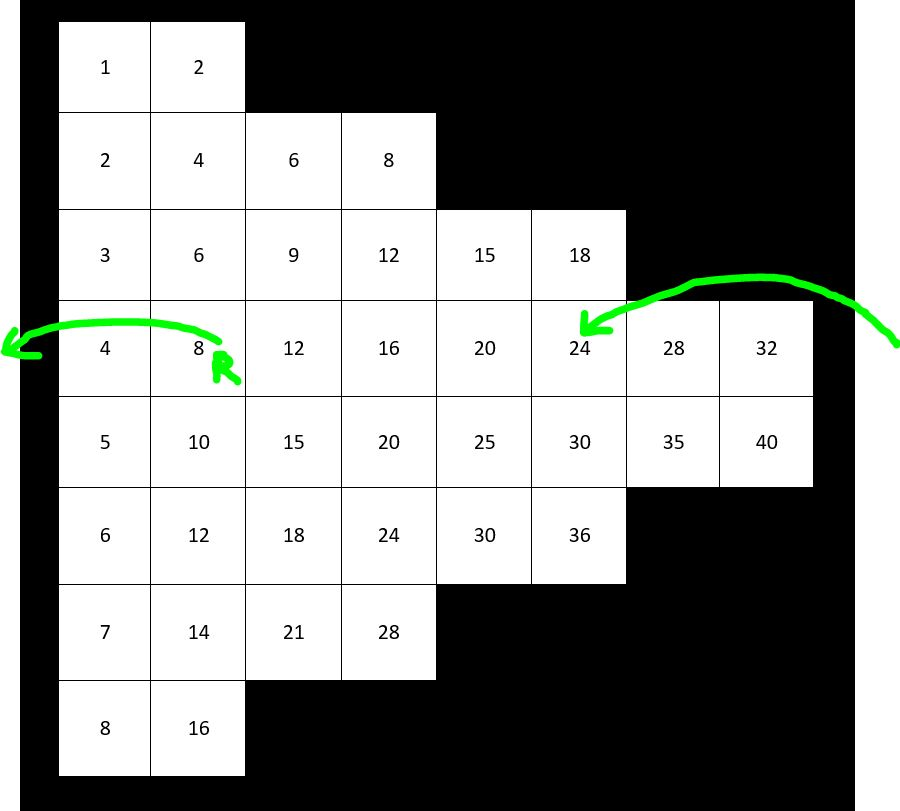
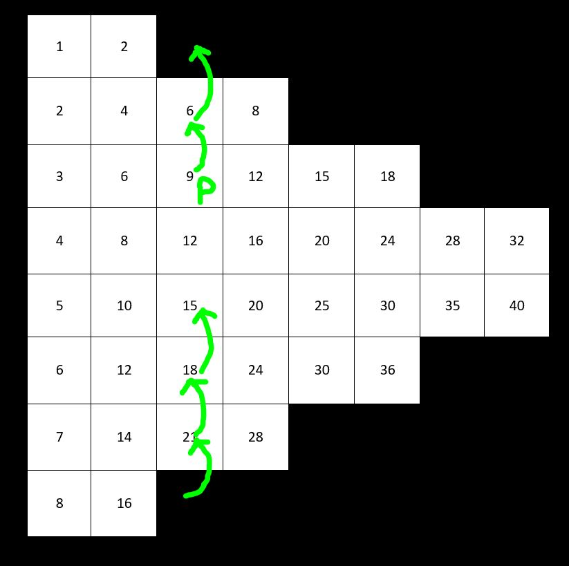

#### _Telerik Academy Season 2016-2017 / C# Advanced Exam - 01 June 2016_

# Task 3: Animal planet

## Description

You are given a two-dimensional map that represents a forest. The map structure is like a jagged array, and it looks like this:  



The terrain follows a pattern. You are given the **base columns count**, which represents the **columns count for the first row**. **In our case**, the base columns count is **2**. You are also given the **total number of rows** for the terrain. **In our case**, the total number of rows is **8**.  
For the first row we have **(1 \* (base columns count))** columns.  
For the second row we have **(2 \* (base columns count))** columns.  
For the third row we have **(3 \* (base columns count))** columns.  
And so on..

The values that are inside each cell are also generated by a pattern, which you should find out by yourself.  
These values represent **points**, which must be **collected**.

There are **two animals** on the map - a **rabbit** and a **porcupine**.
**Once an animal steps on one of the cells of the map - it automatically collects the points which are inside that cell**.   
Once collected, the points cannot be recollected again by an animal that steps in the same cell.  

The rabbit can jump from one cell to another, and he is able to jump only in straight lines, based on the direction he is facing.  
The possible directions are **TOP, BOTTOM, LEFT, RIGHT**.  
Which means that if the rabbit is currently at position **[Row = 1]\[Col = 2]** and he is facing to the **LEFT**, if he receives an order to move **2 steps**, he must jump directly to position **[Row = 1]\[Col = 0]**, without stepping on the cells in between. As the rabbit lands, he collects the points from the cell at the targeted position.  

The porcupine cannot jump and it can move only **1 cell at a time**. Again - only in straight lines, based on the direction he is facing. Which means that if the porcupine is currently at position **[Row = 1]\[Col = 2]** and he is facing to the **BOTTOM**, if he receives an order to move 2 steps, he must move to position **[Row = 3]\[Col = 2]**, by stepping on each cell on his path and collecting the points in these cells.

There's a catch - **if the porcupine meets a rabbit on his path, he must stop moving just before he steps on the rabbit**. The same is applied for the rabbit movements - if a rabbit is about to land on a porcupine, he must regulate his movement in such a way, that he lands **1 cell** before he steps on the porcupine.  

Last catch - if an animal is ordered to move N steps, but the result position is outside the boundaries of the map, the animal must continue his movement starting from the opposite side of the current dimension he is moving in.  
_**Example**:_ If the rabbit is at position **[3][1]** (where 3 is the rows index, and 1 is the columns index), and he must jump **4 steps** (N), facing the direction **"LEFT"**, he will overflow and he must calculate his final position in such a way, that he counts the **M** cells he must jump over before the overflow, and then he continues its jump for the next **N - M** cells. As a result, the rabbit's final position will be **[3][5]**.

   

**The same is applied for the porcupine movements**:  
_Example: The porcupine is at position [2][2] and he must move 4 steps, facing "TOP". As a result, his position will be [4][2]._  

  

So your task is to build the map and move the animals by the commands you will be given. Count the points collected by each of the two animals and when you receive "END" as a command - you will have to print a final result for one of the following 3 cases:   

1. If the rabbit's score is higher than that of the porcupine - print a line by the given pattern:  
_The rabbit WON with **{RabbitPointsCount}** points. The porcupine scored **{PorcupinePointsCount}** points only._  
**Example**:   
The rabbit WON with **122** points. The porcupine scored **116** points only.   

2. If the porcupine's score is higher that that of the rabbit - print a line by the given pattern:  
_The porcupine destroyed the rabbit with **{PorcupinePointsCount}** points. The rabbit must work harder. He scored **{RabbitPointsCount}** points only._  
**Example**:  
The porcupine destroyed the rabbit with **457** points. The rabbit must work harder. He scored **118** points only.  

3. If the scores are equal - print a line by the given pattern:  
_Both units scored **{OneOfTheUnitsScore}** points. Maybe we should play again?_  
**Example**:  
Both units scored **35** points. Maybe we should play again?  

## Input

The input data should be read from the console.

On the **first console line** you will receive **1 integer**, which represents the **base columns count**.  
On the **second console line** you will receive **1 integer**, which represents the **total rows count**.  
On the **third console line** you will receive **two integers**, separated by a single whitespace, which represent the **initial coordinates** of the **porcupine**.  
On the **fourth console line** you will receive **two integers** separated by a single whitespace, which represent the **initial coordinates** of the **rabbit**.  
On each of the next **X lines** you will receive a command in the following format: "**Unit Direction Steps**", where **Unit** is the name of the unit that must be moved, **Direction** is the direction that the unit must face before he executes the movement and **Steps** is the number of cells that must be walked or jumped by that **Unit**.   
Process commands until you receive **"END"** as an input.

The input data will always be valid and in the format described. There is no need to check it explicitly.

## Output

The output data should be printed on the console.  
On the only output line, print the result of the given sequence of commands using the corresponding pattern as described above.

## Constraints
- **"UnitName"** will always be a single letter - **"R"** for the rabbit and **"P"** for the porcupine.  
- **"Direction"** will always be a single letter - **"T"** for "TOP", **"R"** for "RIGHT", **"B"** for "BOTTOM", **"L"** for "LEFT".  
- **"Steps"** will be a positive integer between **1** and **Current moving dimension size** inclusive.  
- **"Base Columns Count"** will always be an **integer** with a value between **1** and **100** inclusive.  
- **"Total Rows Count"** will always be an **EVEN integer** with a value between **2** and **100** inclusive.  
- **"Initial coordinates"** will always be somewhere inside the map.  
- **"Instructions count (X)""** will always be between **1** and **50** inclusive.  
- **Time limit: 0.1 s**  
- **Memory limit: 36 MiB**  

## Examples

### Input
```
3
8
0 0
1 1
R T 3
R L 3
R B 2
R R 3
R R 3
R R 2
R T 1
P T 3
P L 3
P B 2
P R 3
P R 3
P R 2
P T 1
P T 2
R L 2
END
```

### Output
```
The porcupine destroyed the rabbit with 457 points. The rabbit must work harder. He scored 118 points only.  
```

### Input
```
2
6
0 0
1 1
R T 3
R L 3
R B 2
R R 3
R R 3
R R 2
R T 1
P T 3
P L 3
P B 2
P R 3
P R 3
P R 2
P T 1
P T 2
R L 2
R T 2
R L 2
R B 1
R B 3
R R 1
R B 1
R B 2
END
```

### Output
```
The rabbit WON with 122 points. The porcupine scored 116 points only.
```

### Input
```
3
8
0 0
1 1
R L 1
P B 1
P R 2
R B 3
P B 2
R T 2
R L 3
P L 1
P B 1
END
```

### Output
```
Both units scored 35 points. Maybe we should play again?
```
